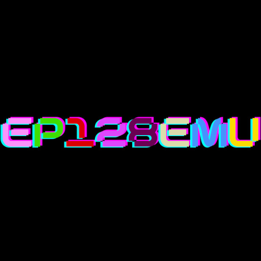

# Enterprise - 64/128 (ep128emu)

### Description

ep128emu is a portable emulator of the Enterprise 64/128, ZX Spectrum 48/128, and Amstrad CPC 464/664/6128 computers.

### License

GPLv2

### Icon

### Fanart

Help make me fanart!

### Screenshots

Help make me screenshots!
